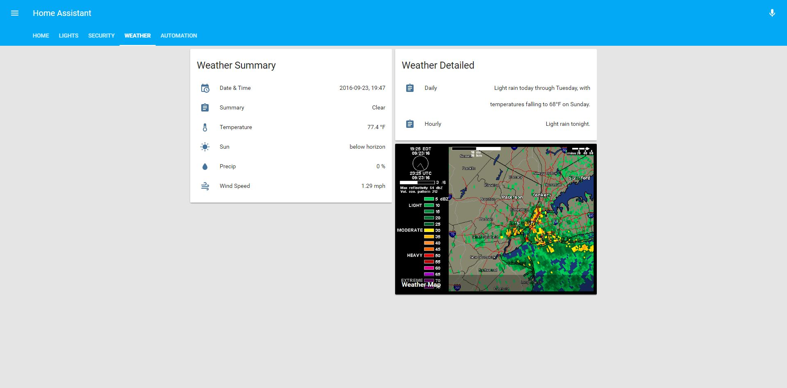

This is my current Home Assistant configuration.

As I add more devices, I'll be constantly enhancing this system to meet my needs.

#My Devices

* [Ecobee 3](https://www.amazon.com/ecobee3-Smarter-Thermostat-Remote-Generation/dp/B00ZIRV39M/ref=sr_1_1?s=hi&ie=UTF8&qid=1474673634&sr=1-1&keywords=ecobee%2B3&th=1) + 2 Sensors
* [Philips Hue Hub] (https://www.amazon.com/Philips-458489-Hue-Bridge-Frustration/dp/B014H2P42K/ref=sr_1_2?ie=UTF8&qid=1474673797&sr=8-2&keywords=philips+hue+hub) + Hue Color and White Bulbs
* [Wink Hub] (https://www.amazon.com/Wink-PWHUB-WH18-Connected-Home-Hub/dp/B00PV6GAI4/ref=sr_1_1?ie=UTF8&qid=1474673863&sr=8-1&keywords=winkhub)
* [GoControl Z-Wave Home Security Suite] (https://www.amazon.com/GOCONTROL-WNK01-311KIT-Premium-Z-Wave-Security/dp/B00XUXYT6K/ref=sr_1_2?ie=UTF8&qid=1474673925&sr=8-2&keywords=gocontrol) (connected via Wink Hub)
* [Schlage Connect Touchscreen Deadbolt] (https://www.amazon.com/dp/B00AGK9L4U/ref=twister_B00O518IPO?_encoding=UTF8&psc=1) (connected via Wink Hub)
* [Ecolink Z-Wave Door/Window Sensor] (https://www.amazon.com/dp/B00HPIYJWU/ref=sr_ph_1?ie=UTF8&qid=1474674080&sr=sr-1&keywords=ecolink%2Bdoor%2Bsensor&th=1)
* [Asus RT-AC68U Router] (https://www.amazon.com/RT-AC68U-Wireless-AC1900-Dual-Band-Gigabit-Router/dp/B00FB45SI4/ref=sr_1_3?s=pc&ie=UTF8&qid=1474674147&sr=1-3&keywords=asus+router)
* [Amazon Echo] (https://www.amazon.com/Amazon-Echo-Bluetooth-Speaker-with-WiFi-Alexa/dp/B00X4WHP5E/ref=sr_1_1?ie=UTF8&qid=1474674225&sr=8-1&keywords=amazon+echo)

#My UI

